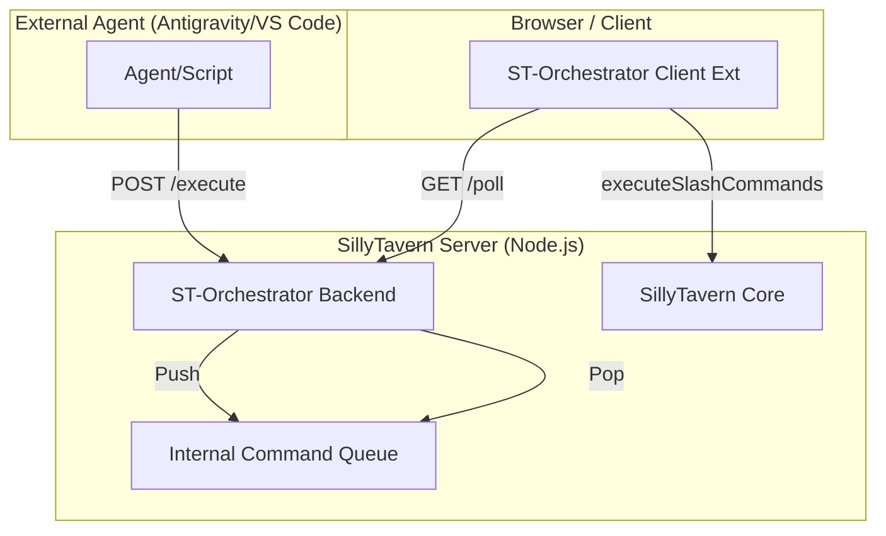

# Current Architecture Map: Taverna Proto

Visual and technical representation of the existing isolation and integration points.

## System Components

## Repository Structure Isolation (Nested Reality)

- **Taverna Root:** Sane repository tracking project documentation and auxiliary components (`extras`, `tts`).
- **SillyTavern Dir:** Nested repository, git-ignored by root, acting as the operational runtime.
- **Plugins Dir:** Contains isolated modules.
- **Data Dir:** Contains client-side extensions and user configurations.

## Integration Points

1. **HTTP/REST:** Bridge between Agent and SillyTavern Server via the plugin router.
2. **Polling:** Decoupled bridge between Browser Client and Server State.
3. **Execution:** Internal JS call to the ST Core engine.

---
*Generated based on forensic analysis - 2026-03-09.*
